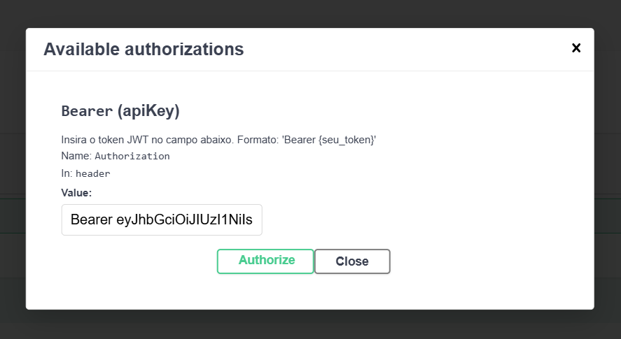
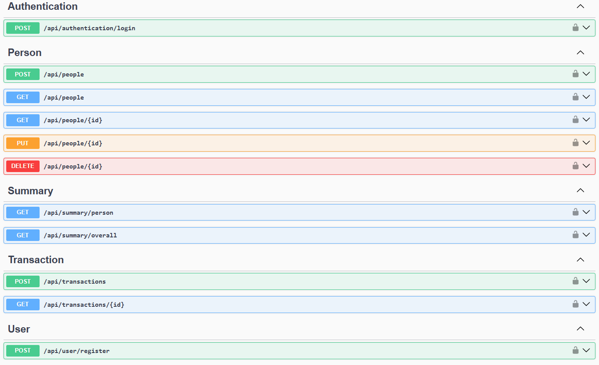

# API ERPControle!

## Objetivos e Requisitos do Teste

Esta API foi desenvolvida para atender integralmente aos requisitos do teste, os quais incluem:

1. Cadastro de Pessoas: Criar, deletar e listar as pessoas, garantindo que ao excluir uma pessoa, todas as transações associadas também sejam removidas.

2. Cadastro de Transações: Criação e listagem de transações, com validação para permitir apenas o registro de despesas para pessoas menores de 18 anos.

3. Consulta de Totais: Geração de relatórios individuais por pessoa, exibindo o total de receitas, despesas e o saldo (receitas - despesas), além de um resumo geral com os totais de todas as pessoas.

**Funcionalidades Adicionais Implementadas**

1. Autenticação com JWT: Implementação de autenticação para proteger as rotas da API.
2. Persistência com Banco de Dados PostgreSQL
3. Utilização de um banco de dados relacional com migrations para criação e manutenção do esquema.

---

## Tecnologias Utilizadas

- Backend: .NET Core
- Banco de Dados: PostgreSQL (Modelo Relacional)
- Autenticação: JWT
- Ferramentas de Desenvolvimento: Visual Studio Code, Git

---

## Como Rodar o Projeto

1. Navegue até a pasta do projeto:

```
  cd ERPControle
```

2. Restaure as dependências:

```
  dotnet restore
```

4. Banco de Dados:

O banco de dados PostgreSQL foi configurado no servidor Render. Utilizei migrations para criar a estrutura relacional e inicializar o banco de dados. Portanto, não é necessário se preocupar com a conexão, pois a string de conexão já está configurada nas configurações do projeto. Basta rodar a aplicação e testar a API.

6. Inicie a aplicação:

```
  dotnet run
```

---

## Teste a API

1. **Cadastro, Login e Uso do Token**

Esta seção explica como registrar um usuário e fazer login para obter um token JWT que será usado para autenticar as próximas requisições. Para verificar os parâmetros e as rotas disponíveis, acesse a documentação completa via Swagger na URL:

```
  http://localhost:5000/swagger/index.html
```

2. Cadastre um Novo Usuário:

- **Observação:** No banco de dados já existe um usuário com as credenciais: UserName: adm, senha: adm e email: adm@example.com. Caso não queira salvar um novo user, use essas credenciais para fazer a autenticação.
- No Swagger, localize a seção Users.
- Clique em POST /api/user/register para expandir a rota de cadastro.
- Clique no botão Try it out (canto superior direito da caixa da requisição).
- No campo de exemplo que aparecer, preencha com os dados do usuário. Exemplo:

```
  {
    "userName": "maxiprod",
    "password": "maxiprod",
    "email": "maxiprod@example.com"
  }
```

Depois de preencher, clique em Execute para enviar a requisição. Verifique a resposta para confirmar que o cadastro foi realizado com sucesso. 

3. **Login**

- No Swagger, localize a seção Authentication.
- Encontre a rota POST /api/authentication/login.
- Clique em Try it out.
- Preencha os campos com o nome de usuário e senha cadastrados:

```
  {
    "userName": "maxiprod",
    "password": "maxiprod"
  }
```

Clique em Execute e copie o token JWT que aparecerá na resposta. Ele será algo parecido com:

```
  eyJhbGciOiJIUzI1NiIsInR5cCI6IkpXVCJ9...
```

4. **Adicione o Token para Acessar Rotas Protegidas**

- No topo direito da página do Swagger, clique em Authorize.
- Na janela que abrir, digite *Bearer*, coloque um espaço e cole o token no seguinte formato:

```
  Bearer eyJhbGciOiJIUzI1NiIsInR5cCI6IkpXVCJ9...
```



Clique em Authorize e depois em Close.

5. **Testando Outras Rotas Protegidas**

- Agora você pode acessar rotas que exigem autenticação.
- Escolha uma rota, clique em ➤ para expandir.
- Clique em Try it out, preencha os parâmetros necessários e clique em Execute.
- O Swagger enviará a requisição usando o token que você adicionou.

---

## Rotas

- **Authentication**
  - Rota: POST /api/authentication/login: Recebe as credenciais e retorna um token de acesso. Em caso de falha, retorna erro 401 com mensagem informativa.

- **User**
  - Rota: POST /api/user/register: Cadastra o novo usuário com os dados de registro e, se a operação for bem-sucedida, retorna uma mensagem de sucesso, caso contrário, retorna um erro se o usuário já estiver cadastrado.

- **People**
  - Rota: POST /api/people: Salva uma nova pessoa com os dados enviados e retorna o status 201 (Created).
  - GET /api/people/{id}: Busca uma pessoa específica pelo ID e retorna os dados da pessoa se encontrada ou um erro 404 (Not Found) caso não exista.
  - GET /api/people: Retorna a lista de todas as pessoas cadastradas.
  - PUT /api/people/{id}: Atualiza os dados de uma pessoa existente pelo ID. Após validar os dados enviados, atualiza e retorna a pessoa atualizada. Se o ID não existir, retorna 404.
  - DELETE /api/people/{id}: Exclui uma pessoa pelo ID. Se a pessoa for encontrada, realiza a exclusão e retorna os dados da pessoa removida; caso contrário, retorna 404.

- **Summary**
  - GET /api/summary/person: Obtém o resumo individual por pessoa.
  - GET /api/summary/overall: Obtém o resumo geral de todas as pessoas.

- **Transactions**
  - POST /api/transactions: Recebe os dados da transação, valida as informações e cria a transação. Se a operação falhar, por exemplo, devido à regra de negócio de que pessoas menores de 18 anos só podem registrar despesas, retorna uma mensagem de erro. Em caso de sucesso, retorna status 201 (Created).
  - GET /api/transactions/{id}: Busca e retorna os detalhes da transação informada pelo id. Caso a transação não seja encontrada, retorna 404 (Not Found).



### Dicas Extras

- Parâmetros de Requisição: O Swagger exibe claramente quais parâmetros são obrigatórios para cada rota.
- Token Expirado: Se receber erro de autenticação, faça o login novamente para obter um novo token.
- Sem Instalação: Todo o teste pode ser feito diretamente no Swagger, sem necessidade de ferramentas externas.

A API estará disponível em http://localhost:5000.

## Estrutura de Pastas

O projeto foi organizado por **funcionalidades**, cada funcionalidade possui sua própria pasta, e dentro dela estão as subpastas como `Controllers`, `Services`, `DTOs`, entre outras.

### Pastas Principais:

- **Auth/** → Funcionalidades relacionadas para autenticar usuário
- **Users/** → Funcionalidades relacionadas a usuários (cadastro, etc.)
- **Infra/** → Configurações gerais de infraestrutura, como JWT e swagger.
- **Data/** → Configuração do banco de dados.
- **Transactions/** → Funcionalidades relacionadas a transações financeiras (criação e listagem).
- **Summary/** → Funcionalidades de relatórios (criação, listagem, etc).
- **People/** → Funcionalidades relacionadas ao gerenciamento de pessoas (criação, listagem, etc).

---

### Resumo
Com essas informações, será possível rodar a aplicação de uma forma fácil.